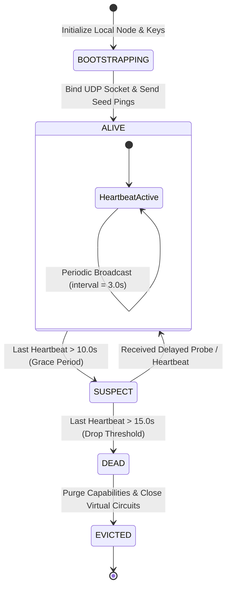
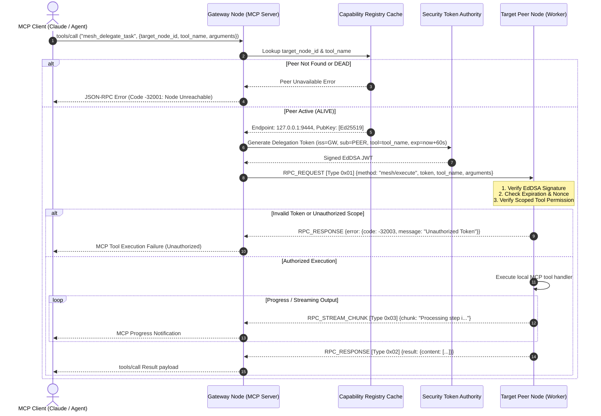
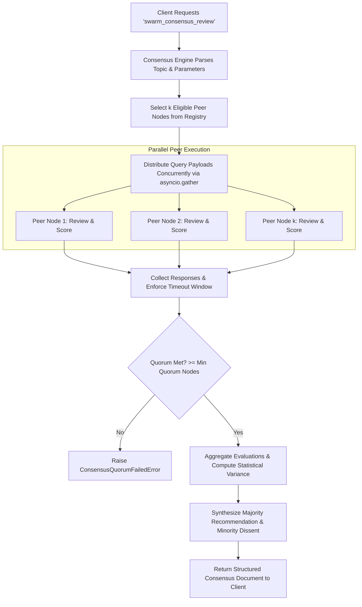

# System Architecture: `mcp-p2p-swarm-mesh`

## 1. Top-Level Architectural Overview

The `mcp-p2p-swarm-mesh` transforms isolated Model Context Protocol (MCP) servers into a coordinated, decentralized computing mesh. External LLM applications (clients such as Claude Desktop, autonomous multi-agent runtimes, or command-line orchestrators) connect strictly to a **Gateway Node** using official MCP transports (Stdio or SSE). The Gateway acts as a protocol facade that dynamically aggregates capabilities across the mesh and delegates execution over secure peer-to-peer virtual circuits.

```
       +-------------------------------------------------------------+
       | Upstream MCP Clients (Claude Desktop, Auto-Agents, CLI)    |
       +-------------------------------------------------------------+
                                      |
                     Standard MCP Transports (Stdio / SSE)
                     JSON-RPC 2.0 (mcp:// protocol specs)
                                      v
+===========================================================================+
|                            GATEWAY NODE                                   |
|  +---------------------------------------------------------------------+  |
|  | Standard MCP Facade Server (tools/list, tools/call, resources/read) |  |
|  +---------------------------------------------------------------------+  |
|  | Capability Registry Cache (`mesh://capabilities/registry`)          |  |
|  +---------------------------------------------------------------------+  |
|  | Mesh Dispatcher & Router (Token Signer, Request Multiplexer)        |  |
|  +---------------------------------------------------------------------+  |
|  | Gossip Engine & Node Failure Detector (15s Heartbeat Window)       |  |
+===========================================================================+
        |                     |                             |
   TLS 1.3 Virtual       TLS 1.3 Virtual               TLS 1.3 Virtual
   Circuit (Stream)      Circuit (Stream)              Circuit (Stream)
        |                     |                             |
        v                     v                             v
+------------------+  +------------------+          +------------------+
|   PEER NODE A    |  |   PEER NODE B    |          |   PEER NODE N    |
| (Python Runner)  |  | (SQL Analyzer)   |          | (Code Synthesis) |
|  - MCP Tools     |  |  - MCP Tools     |  ...     |  - MCP Tools     |
|  - P2P Daemon    |  |  - P2P Daemon    |          |  - P2P Daemon    |
|  - Token Verifier|  |  - Token Verifier|          |  - Token Verifier|
|  - Gossip Agent  |  |  - Gossip Agent  |          |  - Gossip Agent  |
+------------------+  +------------------+          +------------------+
        ^                     ^                             ^
        |                     |                             |
        +======== Anti-Entropy Gossip / UDP Mesh Layer =====+
```

---

## 2. Gateway-to-Peer Topology & Transport Multiplexing

### 2.1 Wire Multiplexing & Framing
Nodes establish persistent, bi-directional asynchronous TCP/TLS sockets. Because multiple JSON-RPC calls and asynchronous response streams may traverse the same physical socket concurrently, all frames on the wire utilize a **Length-Prefixed Framing Protocol**:

```
 0                   1                   2                   3
 0 1 2 3 4 5 6 7 8 9 0 1 2 3 4 5 6 7 8 9 0 1 2 3 4 5 6 7 8 9 0 1
+-+-+-+-+-+-+-+-+-+-+-+-+-+-+-+-+-+-+-+-+-+-+-+-+-+-+-+-+-+-+-+-+
|                   Frame Length (32-bit uint)                  |
+-+-+-+-+-+-+-+-+-+-+-+-+-+-+-+-+-+-+-+-+-+-+-+-+-+-+-+-+-+-+-+-+
|                   Magic Byte (0x53 = 'S') | Msg Type (8-bit)  |
+-+-+-+-+-+-+-+-+-+-+-+-+-+-+-+-+-+-+-+-+-+-+-+-+-+-+-+-+-+-+-+-+
|                                                               |
|                 Payload (JSON-RPC 2.0 / UTF-8)                |
|               Length = (Frame Length - 2) bytes               |
|                                                               |
+-+-+-+-+-+-+-+-+-+-+-+-+-+-+-+-+-+-+-+-+-+-+-+-+-+-+-+-+-+-+-+-+
```

* **Frame Length (4 Bytes)**: Big-endian unsigned 32-bit integer indicating total frame payload length following the length header.
* **Magic Byte (1 Byte)**: `0x53` (`'S'` for Swarm) ensures protocol synchronization and immediate boundary validation.
* **Message Type (1 Byte)**:
  * `0x01` (`RPC_REQUEST`): Client-to-Peer JSON-RPC request frame.
  * `0x02` (`RPC_RESPONSE`): Peer-to-Client JSON-RPC response frame.
  * `0x03` (`RPC_STREAM_CHUNK`): Chunked streaming output frame for long-running tool outputs.
  * `0x04` (`HEARTBEAT`): Keep-alive ping/pong frame.
  * `0x05` (`ERROR_FRAME`): Low-level protocol violation frame.

### 2.2 Asynchronous Stream Demultiplexer
On each established channel, a dedicated background coroutine (`_demux_loop`) continuously parses inbound length-prefixed frames and routes them based on the JSON-RPC `id`:
1. Requests with a unique UUID string `id` allocate an `asyncio.Future` in an internal `pending_requests` map.
2. Incoming `RPC_RESPONSE` frames resolve the matching `Future`.
3. In-flight `RPC_STREAM_CHUNK` frames are pushed into a dedicated `asyncio.Queue` associated with that `id`.
4. Socket disconnection cleanly aborts all pending `Future` objects with `PeerConnectionDroppedError`.

---

## 3. Gossip Protocol & Decentralized Discovery State Machine

The mesh utilizes an asynchronous epidemic gossip protocol running over UDP (with automatic fallback to TCP peer exchange) to maintain continuous membership state across nodes without requiring centralized coordination.

### 3.1 Node Membership State Transitions



### 3.2 Gossip Payload Structure
Every gossip heartbeat is broadcast every `T_heartbeat = 3.0s` and includes:
```json
{
  "protocol": "mcp-mesh-gossip/1.0",
  "node_id": "node_7f3a9e1b4c8d",
  "listen_host": "127.0.0.1",
  "listen_port": 9443,
  "sequence_number": 1042,
  "timestamp": 1774088400.124,
  "capabilities_hash": "e3b0c44298fc1c149afbf4c8996fb92427ae41e4649b934ca495991b7852b855",
  "tools": [
    {
      "name": "execute_sql_query",
      "description": "Execute sanitized read-only SQL queries on local analytics store.",
      "parameters_schema": { "type": "object", "properties": { "query": { "type": "string" } } }
    }
  ],
  "load_metric": 0.24,
  "peer_sample": [
    { "node_id": "node_1a2b3c4d", "endpoint": "127.0.0.1:9444", "status": "ALIVE" }
  ]
}
```

### 3.3 Anti-Entropy & State Reconciliation
1. **Capabilities Hash**: When a node advertises a new `capabilities_hash` that does not match the Gateway's local cache, the Gateway immediately issues an out-of-band `mcp.capabilities_sync` request over the TLS virtual circuit to pull updated schemas.
2. **Failure Detector**: If no heartbeat is received from a peer within 10 seconds, it transitions to `SUSPECT`. If the silence extends beyond 15 seconds, the failure detector transitions the node to `DEAD`, removing all its registered tools from `mesh://capabilities/registry` and notifying any active downstream callers.

---

## 4. Distributed Task Delegation Sequence

When an external LLM client invokes the tool `mesh_delegate_task` through the Gateway Node, the system coordinates security validation, network routing, and response aggregation through the following sequence:



---

## 5. Swarm Consensus Orchestration (`swarm_consensus_review`)

The swarm consensus orchestrator coordinates distributed deliberation across heterogeneous nodes to reach validated, tamper-resistant conclusions.



1. **Selection Strategy**: The engine filters the `CapabilityRegistry` for nodes offering the requested specialization (or selects `k` least-loaded active nodes).
2. **Fanout & Bounded Execution**: Queries are dispatched concurrently over the existing TLS virtual circuits with a strict deadline (`timeout_seconds`, default 10.0s).
3. **Quorum Verification**: If the number of valid responses is strictly less than `min_quorum` (e.g., 2 out of 3), the execution reports a graceful partial-quorum warning or failure.
4. **Aggregation & Synthesis**: Collects peer ratings, justifications, and confidence scores, synthesizing them into a structured report detailing consensus consensus score, agreements, and outlier viewpoints.

---

## 6. Security Architecture & Capability Token Specifications

### 6.1 Cryptographic Identity
Every node generates a persistent or ephemeral **Ed25519** keypair upon startup:
* **Node ID**: Hex-encoded SHA-256 digest of the raw Ed25519 public key, truncated to 16 characters (`node_` prefix).
* **TLS Certificate**: Ephemeral self-signed X.509 certificate generated in-memory containing the node ID in the Subject Alternative Name (`URI:mcp-node:{node_id}`). Mutual verification ensures only nodes holding valid mesh certificates can open virtual circuits.

### 6.2 Signed Capability Token (JWT) Format
Delegation requests from the Gateway to any Peer Node MUST include an EdDSA-signed JSON Web Token with the following payload schema:

```json
{
  "iss": "node_gateway_01",
  "sub": "node_worker_sql_02",
  "aud": "mcp-p2p-swarm-mesh",
  "jti": "8b51d6c8-9d41-4775-9289-53e32b8478d1",
  "iat": 1774088400,
  "nbf": 1774088400,
  "exp": 1774088460,
  "capabilities": [
    {
      "action": "execute_tool",
      "resource": "execute_sql_query",
      "constraints": {
        "max_execution_time_ms": 5000,
        "read_only": true
      }
    }
  ]
}
```

* **`jti` (JWT ID)**: Unique cryptographically random UUIDv4. Peers maintain an in-memory sliding-window cache of seen `jti` nonces. Any duplicate `jti` is immediately rejected to prevent replay attacks.
* **`exp`**: Expiration timestamp set to `iat + 60s`, preventing token retention.
* **`capabilities`**: Explicit whitelist of tools and parameters authorized for execution. If a delegated call attempts to trigger an unlisted tool, the receiving peer aborts execution with `-32003 Unauthorized`.
