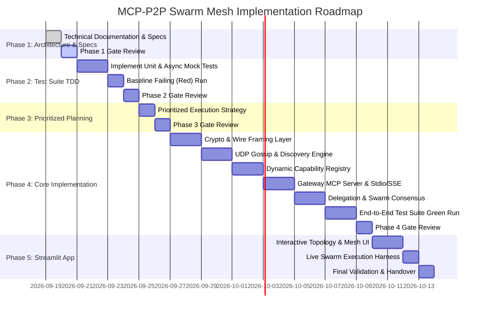

# Implementation Plan: `mcp-p2p-swarm-mesh`

## 1. Executive Summary & Architectural Mission
The `mcp-p2p-swarm-mesh` system is a production-grade, decentralized peer-to-peer (P2P) router and consensus orchestrator designed strictly in **Python 3.10+**. It federates physically distributed, independent Model Context Protocol (MCP) servers into an encrypted, resilient, self-healing swarm mesh. 

A central Gateway Node acts as the transparent bridge for upstream MCP clients (e.g., Claude Desktop, Cursor, external autonomous LLM agents) over standard Model Context Protocol transports (Stdio and Server-Sent Events [SSE]). Internally, the Gateway and all swarm peers communicate over an asynchronous, multiplexed, TLS-encrypted peer-to-peer network fabric driven by a gossip-based discovery protocol, distributed capability registry, signed cryptographic delegation tokens, and multi-node consensus review routines.

---

## 2. Technical Stack & Dependency Architecture

### 2.1 Core Runtime Environment
* **Language Runtime**: Python 3.10, 3.11, and 3.12 (standardized on 3.12 for reference deployment).
* **Asynchronous Core**: `asyncio` with high-throughput event loop selectors and non-blocking I/O multiplexing.
* **Typing & Validation**: `pydantic >= 2.6.0` (strict schema enforcement for JSON-RPC 2.0 payloads, capability tokens, and registry structures).

### 2.2 Protocol & Network Stack
* **Upstream MCP Protocol**: `mcp >= 1.2.0` (Anthropic official Python SDK for Stdio/SSE server lifecycle, session handling, tool/resource/prompt definitions).
* **Wire Multiplexing & Framing**: Length-prefixed binary/JSON-RPC stream framing over `asyncio.StreamReader` and `asyncio.StreamWriter`.
* **Transport Encryption**: Mutual TLS (`ssl.SSLContext` with TLSv1.3, strict cipher suite `TLS_AES_256_GCM_SHA384`, custom X.509/self-signed Ed25519 peer certificates).
* **Gossip Discovery Layer**: Custom async UDP gossip engine with anti-entropy sync, decay failure detector, and vector clock versioning.

### 2.3 Cryptography & Security
* **Cryptographic Primitives**: `cryptography >= 42.0.0` (Ed25519 key generation, X.509 certificate generation, AES-256-GCM encryption).
* **Capability Tokens**: `pyjwt >= 2.8.0` with `cryptography` backend (EdDSA signed tokens carrying granular delegation scopes, nonce replay prevention, and TTL expiration).

### 2.4 Visualization & Web Interface
* **Interactive UI**: `streamlit >= 1.32.0` (real-time mesh topology rendering, capability browser, interactive tool execution runner, swarm consensus dashboard).
* **Graph & Topology**: `networkx >= 3.2.0` (topology graph computation, shortest-path calculation, clustering coefficients) paired with Streamlit graph visualization.

### 2.5 Testing & Quality Assurance
* **Test Framework**: `pytest >= 8.0.0`, `pytest-asyncio >= 0.23.0`.
* **Mocking & Fault Injection**: `pytest-mock`, custom async network latency and packet-loss simulators (`FaultyStreamTransport`).
* **Code Coverage**: `pytest-cov >= 4.1.0` targeting >= 90% branch coverage on routing and security modules.

---

## 3. Milestones & Work Breakdown Structure (WBS)



### Milestone 1: Foundation & Cryptographic Transport (Days 1–3)
* **Goal**: Establish the secure network substrate, cryptographic identity system, and framing protocol.
* **Deliverables**:
  * `mcp_mesh.crypto.identity`: Ed25519 node keypair generation, self-signed TLS certificate generation, node fingerprinting (`node_id = sha256(pubkey)[:16]`).
  * `mcp_mesh.crypto.tokens`: JWT creation, signing, claims validation (`iss`, `sub`, `aud`, `exp`, `capabilities`, `nonce`).
  * `mcp_mesh.protocol.framing`: Length-prefixed (4-byte big-endian uint32) JSON-RPC 2.0 framing codec over async stream readers/writers.

### Milestone 2: Discovery, Gossip & Mesh Routing (Days 4–6)
* **Goal**: Implement decentralized node discovery and heartbeats without single-point-of-failure seed servers.
* **Deliverables**:
  * `mcp_mesh.discovery.gossip`: Async UDP gossip engine broadcasting periodic node presence, peer tables, and incremental topology changes.
  * `mcp_mesh.discovery.failure_detector`: Heartbeat decay detector (15-second cutoff window) triggering automatic node eviction and mesh reorganization.
  * `mcp_mesh.transport.p2p_channel`: Async TCP/TLS bi-directional channel manager with keep-alive, reconnection backoff, and multiplexed stream routing.

### Milestone 3: Dynamic Capability Registry & Task Delegation (Days 7–9)
* **Goal**: Maintain real-time inventory of tools, resources, and prompts across all nodes; enable distributed delegation.
* **Deliverables**:
  * `mcp_mesh.registry.catalog`: Thread-safe, reactive catalog aggregating capabilities advertised by active peers; emits change events upon node join/leave.
  * `mcp_mesh.router.dispatcher`: Request router executing `mesh_delegate_task`, managing request timeouts, backpressure queues, and token verification at destination nodes.
  * `mcp_mesh.consensus.orchestrator`: Consensus engine executing `swarm_consensus_review`, fanning out queries to eligible peer subsets, aggregating responses, and resolving discrepancies via weighted voting.

### Milestone 4: Gateway Node & MCP Surface (Days 10–12)
* **Goal**: Surface the decentralized mesh as a unified standard MCP server.
* **Deliverables**:
  * `mcp_mesh.gateway.server`: Gateway implementation supporting standard I/O (`mcp.server.stdio`) and Server-Sent Events (`mcp.server.sse`).
  * Expose resource `mesh://capabilities/registry`.
  * Expose tool `mesh_delegate_task`.
  * Expose prompt `swarm_consensus_review`.

### Milestone 5: Streamlit Web Control Center (Days 13–15)
* **Goal**: Provide an operator-grade web interface for real-time visualization and interactive execution.
* **Deliverables**:
  * `app.py`: Streamlit dashboard with 4 specialized tabs:
    1. **Topology Matrix**: Live network graph, peer connectivity status, node latency metrics.
    2. **Capability Registry**: Searchable tool catalog, schema viewer, resource tree.
    3. **Task Delegation Workbench**: Form-based tool invocation with live execution stream and latency monitor.
    4. **Swarm Consensus Chamber**: Interactive multi-agent consensus prompts, voting distribution, and aggregated synthesis view.

---

## 4. Risk Matrix & Engineering Mitigations

| Risk ID | Description | Severity | Probability | Technical Mitigation Strategy |
| :--- | :--- | :---: | :---: | :--- |
| **RSK-01** | UDP broadcast packets dropped on restrictive cloud/local virtual interfaces | High | Medium | Implement hybrid discovery: UDP multicast/broadcast for local subnets falling back to direct TCP peer-exchange (PEX) when UDP datagrams fail to establish peer contact. |
| **RSK-02** | Gateway I/O deadlock during heavy multi-agent tool execution | High | Low | Segregate MCP client transport I/O (stdio/SSE) from internal P2P socket loops using dedicated `asyncio.TaskGroup` boundaries and bounded worker queues. |
| **RSK-03** | Token replay attacks across malicious or compromised peers | High | Low | Enforce strict single-use nonces stored in an in-memory sliding-window bloom filter/cache with short token TTLs (default 30 seconds). |
| **RSK-04** | Capability registry inconsistency during transient network partitions | Medium | Medium | Implement vector clocks on capability broadcast payloads; reconcile state via anti-entropy exchanges upon partition healing. |
| **RSK-05** | Streamlit UI latency lag due to polling large mesh topologies | Low | Medium | Utilize thread-safe in-memory state snapshots with caching (`@st.cache_data(ttl=1)`) and decoupled background async collector threads. |

---

## 5. Architectural Quality Attributes & Compliance Mapping

```
+-------------------------------------------------------------------------------+
|                           mcp-p2p-swarm-mesh Spec                             |
+------------------------------------+------------------------------------------+
| Functional Requirements            | Architecture / Implementation Component  |
+------------------------------------+------------------------------------------+
| FR-01: Gateway Node Lifecycle      | mcp_mesh.gateway.server (Stdio/SSE)      |
| FR-02: P2P Transport & Discovery   | mcp_mesh.discovery.gossip + p2p_channel  |
| FR-03: Dynamic Capability Registry | mcp_mesh.registry.catalog (mesh:// URI)  |
| FR-04: Distributed Task Delegation | mcp_mesh.router.dispatcher (delegate)    |
| FR-05: Swarm Consensus Prompts    | mcp_mesh.consensus.orchestrator (review) |
+------------------------------------+------------------------------------------+
| Non-Functional Requirements        | Verification Mechanism                   |
+------------------------------------+------------------------------------------+
| NFR-01: Strict Python 3.10+        | pyproject.toml, mypy --strict, CI tests  |
| NFR-02: TLS 1.3 & JWT Capabilities | PyJWT EdDSA + TLS Context verification   |
| NFR-03: 15s Fault Drop Recovery    | Heartbeat decay detector + chaos tests   |
| NFR-04: <50ms Intra-Mesh Latency   | Benchmarking harness in test suite       |
+------------------------------------+------------------------------------------+
```
