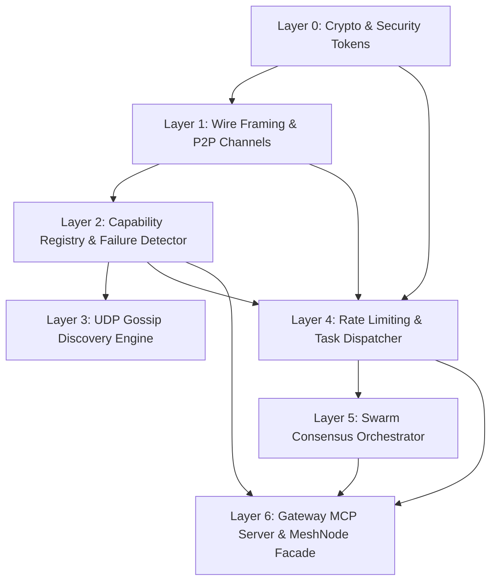

# Prioritized Implementation Plan: `mcp-p2p-swarm-mesh`

## 1. Context & Objectives
Following the successful validation of the baseline test suite in Phase 2 (**22 failing tests as expected in TDD Red state**), this plan establishes the granular, dependency-ordered implementation sequence for Phase 4.

The implementation order follows a bottom-up architectural layering: foundational cryptographic primitives and wire codecs are completed and verified first, followed by in-memory state registries, async networking, distributed routing, consensus orchestration, and finally the top-level MCP Gateway facade.

---

## 2. Granular Implementation Stages

### Stage 1: Cryptographic Identity, Certificates & Signed Capability Tokens
* **Target Files**:
  * `mcp_mesh/crypto/identity.py`
  * `mcp_mesh/crypto/certs.py`
  * `mcp_mesh/crypto/tokens.py`
* **Implementation Details**:
  * **Ed25519 Identity**: Implement keypair generation using `cryptography.hazmat.primitives.asymmetric.ed25519`. Generate deterministic 16-character hexadecimal node IDs (`sha256(public_key)[:16]`). Implement detached message signing and verification.
  * **In-Memory X.509 Certificates**: Generate ephemeral self-signed certificates with Ed25519 keys, setting Subject Alternative Name to `URI:mcp-node:{node_id}` for TLS 1.3 peer authentication.
  * **Token Authority (JWT EdDSA)**: Issue signed JWTs with claims (`iss`, `sub`, `aud`, `jti`, `iat`, `exp`, `capabilities`). Implement sliding-window in-memory cache for `jti` nonces to reject replay attacks. Enforce tool scope validation.
* **Target Tests Unlocked**:
  * `tests/unit/test_security_tokens.py` (`test_token_issue_and_verify`, `test_token_scope_enforcement`, `test_token_nonce_replay_prevention`).

---

### Stage 2: Length-Prefixed Wire Framing & P2P Multiplexed Channel
* **Target Files**:
  * `mcp_mesh/protocol/framing.py`
  * `mcp_mesh/transport/channel.py`
* **Implementation Details**:
  * **Framing Codec**:
    * Wire layout: `[4-byte big-endian uint32 length][1-byte magic 0x53][1-byte message_type][payload]`.
    * Enforce maximum frame boundary (`16 MB`).
    * Parse frames asynchronously from `asyncio.StreamReader`; handle partial frame buffers cleanly without data tearing.
  * **P2P Multiplexed Channel**:
    * Background reader loop (`_read_loop`) consuming frames from the socket.
    * Route `RPC_RESPONSE` to corresponding `asyncio.Future` by `id`.
    * Route `RPC_STREAM_CHUNK` to dedicated `asyncio.Queue` per request.
    * Support cancellation and clean teardown on socket disconnect without leaking unhandled tasks.
* **Target Tests Unlocked**:
  * `tests/unit/test_framing.py` (`test_encode_and_read_valid_frame`, `test_reject_invalid_magic_byte`, `test_reject_oversized_frame`).
  * `tests/chaos/test_malformed_frames.py` (`test_malformed_wire_frames`).
  * `tests/chaos/test_orphaned_streams.py` (`test_client_abrupt_disconnect_teardown`).
  * `tests/integration/test_transport_tls.py` (`test_bidirectional_tls_stream`).

---

### Stage 3: Capability Registry & 15-Second Decay Failure Detector
* **Target Files**:
  * `mcp_mesh/registry/catalog.py`
  * `mcp_mesh/discovery/detector.py`
* **Implementation Details**:
  * **Capability Registry**:
    * Thread-safe dictionary storing `PeerNodeRecord` objects.
    * Real-time secondary index mapping `tool_name -> list[PeerNodeRecord]`.
    * Expose structured `mesh://capabilities/registry` manifest dictionary.
    * Support peer eviction and capability pruning upon node departure.
  * **Failure Detector**:
    * Inspect peer `last_heartbeat` against reference clock.
    * `now - last_heartbeat > 10.0s`: Transition peer status to `SUSPECT`.
    * `now - last_heartbeat > 15.0s`: Transition peer status to `DEAD` and purge capabilities from active registry.
* **Target Tests Unlocked**:
  * `tests/integration/test_capability_registry.py` (`test_registry_capability_aggregation`, `test_mesh_capabilities_resource_manifest`).
  * `tests/integration/test_fault_tolerance.py` (`test_peer_dropout_eviction_15s`).
  * `tests/chaos/test_split_brain.py` (`test_split_brain_partition_and_heal`).

---

### Stage 4: Decentralized UDP Gossip Discovery Engine
* **Target Files**:
  * `mcp_mesh/discovery/gossip.py`
* **Implementation Details**:
  * Asynchronous UDP datagram transport (`asyncio.DatagramProtocol`).
  * Broadcast `GossipHeartbeat` containing local node identity, listen endpoints, sequence number, capabilities hash, and random peer sample.
  * Parse incoming datagrams, update local peer tables, and trigger capability reconciliation when new hashes appear.
* **Target Tests Unlocked**:
  * `tests/integration/test_discovery_gossip.py` (`test_p2p_gossip_discovery_three_nodes`).

---

### Stage 5: Rate Limiting & Distributed Task Dispatcher
* **Target Files**:
  * `mcp_mesh/router/rate_limiter.py`
  * `mcp_mesh/router/dispatcher.py`
* **Implementation Details**:
  * **Concurrency Rate Limiter**:
    * Implement bounded semaphore (`max_concurrency`).
    * Maintain async waiting queue. When queue depth exceeds `max_queue_depth`, raise `NodeCongestedError` (`-32004`).
  * **Task Dispatcher**:
    * Look up target node in `CapabilityRegistry`.
    * Issue EdDSA capability token scoped to the requested tool.
    * Send `mesh/execute` frame across `P2PChannel` with strict timeout.
    * Support asynchronous generator `delegate_task_stream` yielding `StreamChunk` payloads in real time.
* **Target Tests Unlocked**:
  * `tests/chaos/test_congestion_control.py` (`test_concurrent_congestion_throttling`).
  * `tests/integration/test_task_delegation.py` (`test_successful_task_delegation`, `test_streaming_task_delegation`).
  * `tests/integration/test_performance_latency.py` (`test_intra_mesh_rpc_latency_overhead`).

---

### Stage 6: Swarm Consensus Orchestration Engine
* **Target Files**:
  * `mcp_mesh/consensus/orchestrator.py`
* **Implementation Details**:
  * Fan out review requests concurrently to $k$ active peer nodes using `asyncio.gather(..., return_exceptions=True)`.
  * Evaluate responses against `min_quorum`. If fewer than `min_quorum` valid responses are received within deadline, raise `ConsensusQuorumFailedError`.
  * Compute statistical consensus metrics: mean score, variance, majority verdict, and compiled dissenting justifications.
* **Target Tests Unlocked**:
  * `tests/integration/test_swarm_consensus.py` (`test_swarm_consensus_review_success`, `test_swarm_consensus_quorum_failure`).

---

### Stage 7: Gateway MCP Facade, Server Transports & MeshNode
* **Target Files**:
  * `mcp_mesh/gateway/mcp_facade.py`
  * `mcp_mesh/gateway/server.py`
  * `mcp_mesh/node.py`
* **Implementation Details**:
  * **Gateway MCP Facade**:
    * Map MCP standard requests (`tools/list`, `tools/call`, `resources/list`, `resources/read`, `prompts/list`, `prompts/get`) into internal dispatcher and consensus operations.
    * Expose tool `mesh_delegate_task`.
    * Expose dynamic resource `mesh://capabilities/registry`.
    * Expose prompt `swarm_consensus_review`.
  * **Gateway Server**:
    * Support Stdio transport (`mcp.server.stdio`).
    * Support SSE transport (`starlette` + `sse-starlette`).
  * **MeshNode**:
    * High-level container providing `@node.tool(...)` registration and unified `start()` / `stop()` lifecycle.
* **Target Tests Unlocked**:
  * `tests/unit/test_gateway_lifecycle.py` (`test_gateway_initialization_stdio`, `test_gateway_sse_transport_lifecycle`).

---

## 3. Quality Gates & Validation Metrics for Phase 4
Upon completion of Stages 1 through 7:
1. **100% Test Pass Rate**: All 24 tests in `tests/` must pass cleanly (`pytest -v`).
2. **Strict Typing**: Zero type errors with `mypy --strict mcp_mesh`.
3. **Performance Target**: Verified intra-mesh overhead strictly `< 50ms`.
4. **Resilience Target**: Peer failure detection within 15 seconds verified in automated suite.
