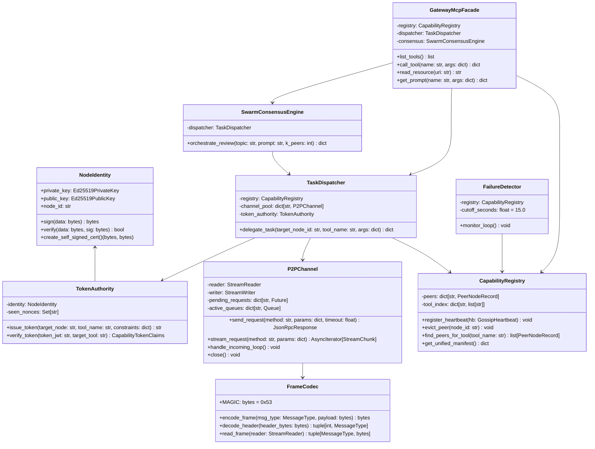

# Software Design Document (SDD): `mcp-p2p-swarm-mesh`

## 1. Module Hierarchy & Package Structure

The system is organized into decoupled, testable packages under the root `mcp_mesh` namespace:

```
mcp-p2p-swarm-mesh/
├── mcp_mesh/
│   ├── __init__.py                 # Package version and top-level exports
│   ├── config.py                   # Pydantic configuration models (ports, timeouts, keys)
│   ├── node.py                     # MeshNode: orchestrates discovery, transport, and registry
│   ├── crypto/
│   │   ├── __init__.py
│   │   ├── identity.py             # Ed25519 identity key generation & node fingerprinting
│   │   ├── certs.py                # In-memory self-signed X.509 TLS certificate generation
│   │   └── tokens.py               # Signed JWT capability token generation and validation
│   ├── protocol/
│   │   ├── __init__.py
│   │   ├── framing.py              # Length-prefixed binary/JSON-RPC wire codec
│   │   ├── messages.py             # Pydantic models for JSON-RPC 2.0 frames & headers
│   │   └── errors.py               # Custom mesh exception hierarchy
│   ├── discovery/
│   │   ├── __init__.py
│   │   ├── gossip.py               # Async UDP gossip broadcast & anti-entropy receiver
│   │   └── detector.py             # Heartbeat decay detector (15-second fault isolation)
│   ├── transport/
│   │   ├── __init__.py
│   │   ├── channel.py              # Bidirectional multiplexed async TLS socket channel
│   │   └── listener.py             # Async TLS TCP server listening for incoming mesh peers
│   ├── registry/
│   │   ├── __init__.py
│   │   ├── models.py               # Pydantic schemas for tools, resources, and peers
│   │   └── catalog.py              # Thread-safe, reactive capability registry (`mesh://`)
│   ├── router/
│   │   ├── __init__.py
│   │   ├── dispatcher.py           # Task delegation router (`mesh_delegate_task`)
│   │   └── rate_limiter.py         # Concurrency throttle & priority queue for overloaded nodes
│   ├── consensus/
│   │   ├── __init__.py
│   │   ├── models.py               # Schemas for swarm consensus queries and evaluations
│   │   └── orchestrator.py         # Multi-node consensus review coordinator
│   └── gateway/
│       ├── __init__.py
│       ├── mcp_facade.py           # Upstream MCP Server exposing tools/resources/prompts
│       └── server.py               # Gateway entrypoint supporting Stdio and SSE transports
├── tests/
│   ├── conftest.py                 # Async fixtures, mock peers, and in-memory certificates
│   ├── unit/                       # Unit tests for framing, crypto, and models
│   ├── integration/                # Multi-node mesh, gossip discovery, and routing tests
│   └── chaos/                      # Dropouts, network partitions, and malformed frames
├── app.py                          # Streamlit Operator Web Application
├── pyproject.toml                  # PEP 621 packaging and dependencies
└── README.md
```

---

## 2. Core Data Models (Pydantic Schemas)

### 2.1 Capability & Peer Models (`mcp_mesh.registry.models`)

```python
from datetime import datetime
from typing import Any, Dict, List, Optional
from pydantic import BaseModel, Field

class ToolParameterSchema(BaseModel):
    type: str = "object"
    properties: Dict[str, Any] = Field(default_factory=dict)
    required: List[str] = Field(default_factory=list)

class MeshToolDefinition(BaseModel):
    name: str
    description: str
    input_schema: ToolParameterSchema
    rate_limit_rpm: Optional[int] = Field(default=60, description="Max requests per minute")

class MeshResourceDefinition(BaseModel):
    uri: str
    name: str
    mime_type: Optional[str] = "application/json"
    description: Optional[str] = None

class MeshPromptDefinition(BaseModel):
    name: str
    description: Optional[str] = None
    arguments: List[Dict[str, Any]] = Field(default_factory=list)

class PeerStatus(str):
    ALIVE = "ALIVE"
    SUSPECT = "SUSPECT"
    DEAD = "DEAD"

class PeerNodeRecord(BaseModel):
    node_id: str
    host: str
    tcp_port: int
    udp_port: int
    public_key_hex: str
    status: str = PeerStatus.ALIVE
    last_heartbeat: float
    sequence_number: int = 0
    tools: List[MeshToolDefinition] = Field(default_factory=list)
    resources: List[MeshResourceDefinition] = Field(default_factory=list)
    prompts: List[MeshPromptDefinition] = Field(default_factory=list)
    load_average: float = 0.0
```

### 2.2 Gossip Protocol Datagram (`mcp_mesh.discovery.gossip`)

```python
class GossipHeartbeat(BaseModel):
    protocol: str = "mcp-mesh-gossip/1.0"
    node_id: str
    listen_host: str
    tcp_port: int
    udp_port: int
    public_key_hex: str
    sequence_number: int
    timestamp: float
    capabilities_hash: str
    tools: List[MeshToolDefinition]
    resources: List[MeshResourceDefinition]
    prompts: List[MeshPromptDefinition]
    load_metric: float
    peer_sample: List[Dict[str, Any]] = Field(default_factory=list)
```

### 2.3 Cryptographic Capability Token Claims (`mcp_mesh.crypto.tokens`)

```python
class CapabilityConstraint(BaseModel):
    max_execution_time_ms: int = 15000
    read_only: bool = True
    allowed_arguments: Optional[List[str]] = None

class CapabilityGrant(BaseModel):
    action: str = "execute_tool"
    resource: str  # Tool name or resource URI
    constraints: CapabilityConstraint = Field(default_factory=CapabilityConstraint)

class CapabilityTokenClaims(BaseModel):
    iss: str  # Issuer node_id
    sub: str  # Destination target node_id
    aud: str = "mcp-p2p-swarm-mesh"
    jti: str  # UUIDv4 nonce to prevent replay
    iat: int  # Epoch issued at
    nbf: int  # Epoch not before
    exp: int  # Epoch expiration (short TTL, e.g. 60s)
    capabilities: List[CapabilityGrant]
```

### 2.4 Wire Frame & JSON-RPC Models (`mcp_mesh.protocol.messages`)

```python
from enum import IntEnum

class MessageType(IntEnum):
    RPC_REQUEST = 0x01
    RPC_RESPONSE = 0x02
    RPC_STREAM_CHUNK = 0x03
    HEARTBEAT = 0x04
    ERROR_FRAME = 0x05

class JsonRpcRequest(BaseModel):
    jsonrpc: str = "2.0"
    id: str
    method: str
    params: Dict[str, Any] = Field(default_factory=dict)

class JsonRpcResponse(BaseModel):
    jsonrpc: str = "2.0"
    id: str
    result: Optional[Any] = None
    error: Optional[Dict[str, Any]] = None

class StreamChunk(BaseModel):
    id: str
    chunk_index: int
    is_final: bool
    payload: Any
```

---

## 3. Component Architecture & Class Specifications



---

## 4. Asynchronous Event Loop Architecture & Concurrency Model

All operations within `mcp-p2p-swarm-mesh` execute on an explicit `asyncio` event loop. To avoid unbounded task proliferation and ensure clean shutdowns, tasks are grouped into structured lifecycles:

```
+===========================================================================+
|                           MeshNode Runtime Loop                           |
+===========================================================================+
|  asyncio.TaskGroup:                                                       |
|                                                                           |
|  [Task 1: Gossip Emitter]                                                 |
|    - Sleeps for T_heartbeat (3.0s)                                        |
|    - Broadcasts GossipHeartbeat datagram over UDP socket                  |
|                                                                           |
|  [Task 2: Gossip Datagram Listener]                                       |
|    - Reads incoming UDP packets                                           |
|    - Updates CapabilityRegistry; reconciles vector clocks                 |
|                                                                           |
|  [Task 3: Failure Detector Sweep]                                         |
|    - Runs every 1.0s; checks (now - peer.last_heartbeat) > 15.0s          |
|    - Triggers evict_peer() and closes stale P2PChannels                   |
|                                                                           |
|  [Task 4: TCP/TLS Listener]                                               |
|    - Accepts inbound peer connections; completes mutual TLS handshake     |
|    - Spawns dedicated P2PChannel frame readers                            |
|                                                                           |
|  [Task 5: Gateway MCP Transport (Stdio or SSE)]                           |
|    - Bridges external JSON-RPC requests to TaskDispatcher / Consensus     |
+===========================================================================+
```

### 4.1 Backpressure and Concurrency Management (`RateLimiter`)
To satisfy **EC-03 (Concurrent Tool Execution Congestion)**:
* Each `P2PChannel` enforces a bounded `asyncio.Semaphore(max_concurrency=10)`.
* When multiple LLM agent threads issue delegations to the same peer node simultaneously, requests exceeding the concurrency limit enter an async priority queue sorted by timestamp and execution priority.
* If the queue depth exceeds 50 items or waiting time exceeds `request_timeout`, the dispatcher raises `PeerNodeCongestionError` (JSON-RPC Error `-32004`).

### 4.2 Clean Teardown & Orphan Prevention (`EC-04`)
* Sockets and background readers are registered with a unified `AsyncExitStack`.
* When a client disconnects abruptly or SIGINT/SIGTERM is caught:
  1. The Gateway signals cancellation across all active `asyncio.TaskGroup` tasks.
  2. In-flight requests receive `PeerDisconnectedError` with partial results if streaming.
  3. All TCP/TLS writer streams are flushed and closed with `writer.close(); await writer.wait_closed()`.

---

## 5. JSON-RPC Wire Protocols (Mesh Internal Methods)

While external clients speak standard MCP JSON-RPC methods (`tools/list`, `tools/call`, `resources/read`), nodes in the mesh communicate over the TLS channels using the following specialized JSON-RPC 2.0 internal RPC methods:

### 5.1 Method: `mesh/execute`
Dispatches a delegated tool execution to a target peer node.
* **Params**:
  * `token` (`string`): Signed EdDSA JWT.
  * `tool_name` (`string`): Target tool name.
  * `arguments` (`dict`): Execution arguments.
* **Success Response**:
  * `result`: `{"content": [{"type": "text", "text": "..."}], "isError": false, "execution_time_ms": 42.1}`
* **Error Response Codes**:
  * `-32001`: Target tool not found or inactive.
  * `-32002`: Execution timeout exceeded.
  * `-32003`: Capability token invalid, expired, or unauthorized.
  * `-32004`: Node congested / rate limit exceeded.

### 5.2 Method: `mesh/capabilities_sync`
Out-of-band request to fetch the complete capability catalog from a newly discovered peer when gossip capabilities hash mismatches.
* **Params**: `{}`
* **Success Response**:
  * `result`: `{"tools": [...], "resources": [...], "prompts": [...]}`

### 5.3 Method: `mesh/consensus_evaluate`
Dispatches a standardized prompt or evaluation payload during a swarm consensus review.
* **Params**:
  * `topic` (`string`): Subject of consensus.
  * `context` (`string`): Review data or code snippet.
  * `evaluation_criteria` (`list[string]`): Specific dimensions to score.
* **Success Response**:
  * `result`: `{"score": 0.88, "verdict": "APPROVE", "justification": "...", "confidence": 0.95}`
